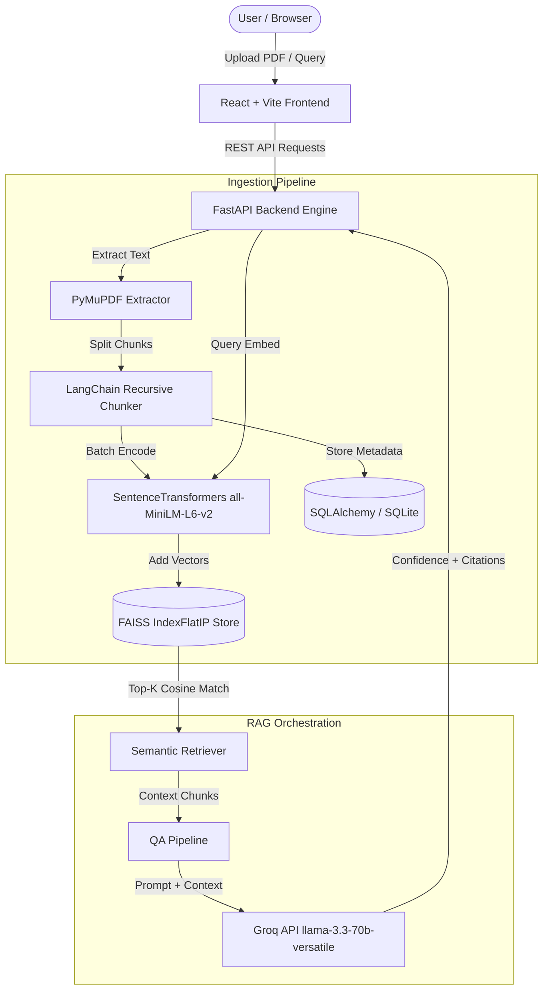

# PolicyPilot Architecture & Technical Specification

## System Overview

PolicyPilot is built on a decoupled modular architecture separating **Data Ingestion**, **Knowledge Storage & Indexing**, **RAG Orchestration & LLM Generation**, and a **Reactive Glassmorphic Client**.

## Core Modules & Design Rationale

### 1. Extractor & Chunker (`services/pdf_extractor.py`, `services/chunker.py`)
- **PyMuPDF (`fitz`)**: Fast C-based PDF text extraction page by page. Preserves page boundaries and detects password locks or image-only PDFs.
- **Recursive Character Splitter**: Splits text with 1000-character target chunk sizes and 200-character overlaps. Crucially, each chunk retains its exact 1-indexed `page_number` for source attribution.

### 2. Embeddings & FAISS Store (`services/embedder.py`, `services/vector_store.py`)
- **Model**: `sentence-transformers/all-MiniLM-L6-v2` producing 384-dimensional dense vectors.
- **Normalisation & Cosine Metric**: Embeddings are L2-normalized during encoding, allowing `faiss.IndexFlatIP` (Inner Product) to compute exact cosine similarity rapidly.
- **ID Map Persistence**: Vector store maintains a serialised `id_map.pkl` mapping FAISS ordinal indices to relational `Chunk.id` records in SQLite.

### 3. RAG QA Pipeline & Confidence Engine (`services/qa_pipeline.py`)
- **Threshold Filtering**: Chunks with a similarity score below `SIMILARITY_THRESHOLD` (0.30) are excluded to prevent hallucination.
- **Confidence Scoring**: The LLM is instructed in system prompts to evaluate the coverage of available context and append a `[CONFIDENCE: X.XX]` tag, which is parsed into numerical scores and rendered as color-coded UI badges.

### 4. Frontend Design System (`styles/index.css`)
- Custom HSL color tokens for deep navy background (`#050810`), luminous teal accents (`#1ee0c5`), and amber callouts.
- Glassmorphic card classes with backdrop filters (`backdrop-blur-xl`), animated dropzones, and smooth scroll behavior.
